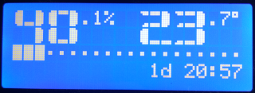
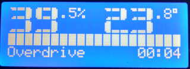
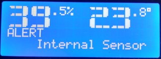

# eq - transcendental fan controller ;)

Based on the amateur and hobby framework allows writing cross-platform software - Arduino.

* Fan speed control based on current humidity and temperature measurements.
* Display of current humidity and temperature values, and their trends in time.
* Measuring the actual fan speed (tachometer) and displaying it.
* Monitoring the internal temperature of the controller (the housing is hermetic) and sleeping the device when the set temperature is exceeded.
* The ability to manually force the maximum fan speed for a given period of time.
* Automatic fan activation at a specified time interval and for a specified time (fan duct blowing).
* Automatic display switching off after a specified time; the display turns on after increasing the light intensity in the room or after manual enforcement.
* Self-diagnostics of sensors during controller startup.
